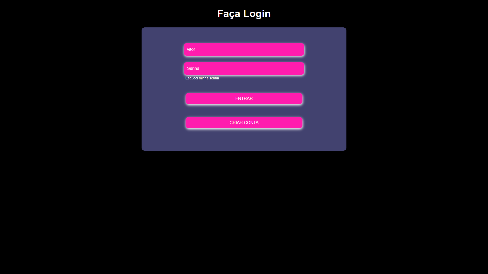
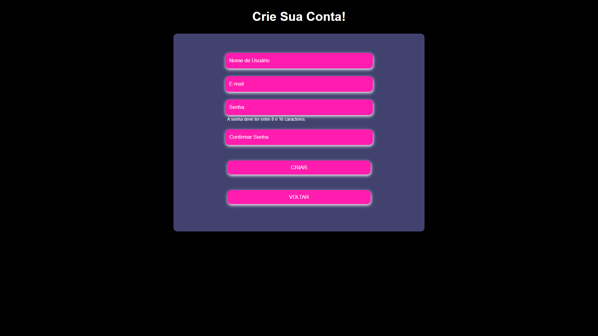
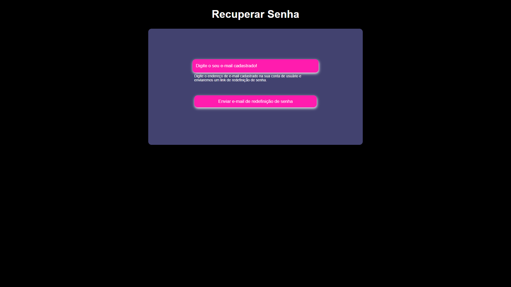
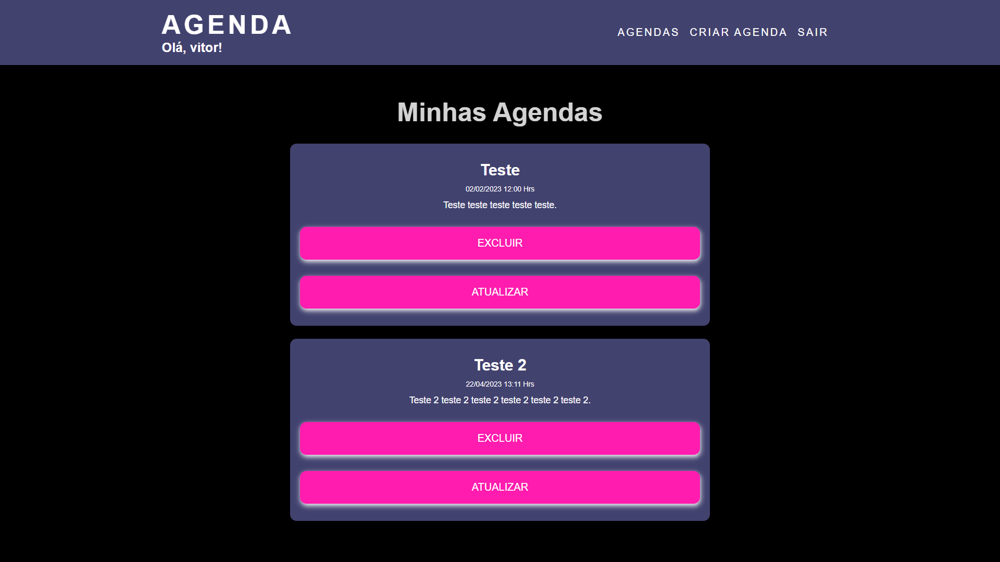
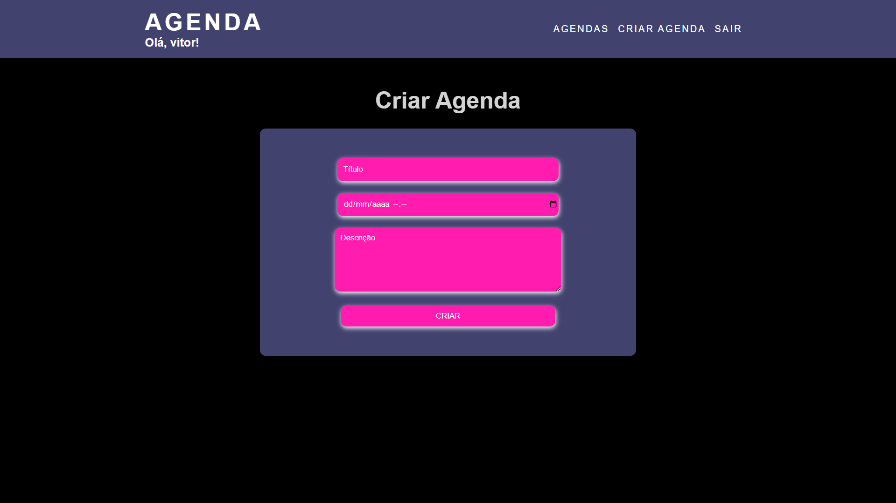
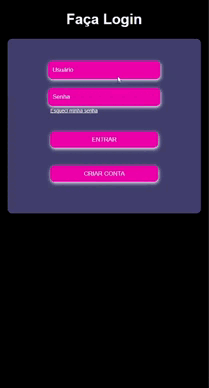

# Projeto Django - Agenda

## Descrição

Este projeto é uma agenda de anotações, desenvolvida em Django.
Para este projeto foi desenvolvido uma pagina de login de usuário, onde o fronte-end faz uma requisição HTTP para o back-end solicitando a permissão de acesso, caso o usuário não esteja cadastrado no banco de dados ou a senha esteja incorreta o Django retorna uma mensagem de erro, neste caso se o usuário não estiver registrado a possibilidade da criação  de um novo usuário, se o usuário já tiver uma conta mas esqueceu sua senha ele pode solicitar a redefinição de senha.
Uma das partes do projeto que eu achei mais desafiador, foi na parte de redefinição de senha, pois deveria criar uma estratégia segura e eficiente. Minha lógica foi a seguinte: Ao ser solicitada a redefinição de senha o sistema pede ao usuário o seu e-mail cadastrado para que seja enviado um link, como a regra do meu sistema é que cada usuário registrado tenha um e-mail único, não a riscos deste link ser enviado para mas de um usuário.
Como meu sistema sabe que o link enviado é relacionado a um usuário especifico? Você deve ter se perguntado, né? Ai esta a grande sacada da parada, vamos a explicação. O meu back-end gera uma sequencia aleatória de 100 caracteres maiúsculos de A à Z, e concatena esta sequência com o id do usuário para garantir que a sequência aleatória seja única, ao criar este código de recuperação eu o registro no banco de dados e crio uma relação com o usuário e logo depois lhe envio o link/código por e-mail, quando o usuário clicar no link o back-end da aplicação irá receber o código passado por parâmetro e irá verificar no banco a qual usuário o código esta relacionado. Observação: Toda vez que o usuário solicitar uma redefinição de senha ou finaliza-lá, o código será excluído do banco de dados da aplicação para que um novo link seja gerado.

## Requisitos

 - Python 3.10.9
 - Django 4.1.7

## Imagens do Projeto

## O layout do sistema é 100% responsivo!

<a href="https://www.linkedin.com/feed/update/urn:li:activity:7039247488897171456/"><button type="button" style="
    cursor: pointer;
    background-color: #5959AB;
    color: #fff;
    padding: 10px;
    border: none;
    border-radius: 50px;
    font-family: Arial, Helvetica, sans-serif;
">Vídeo do Projeto no Linkedin</button></a>